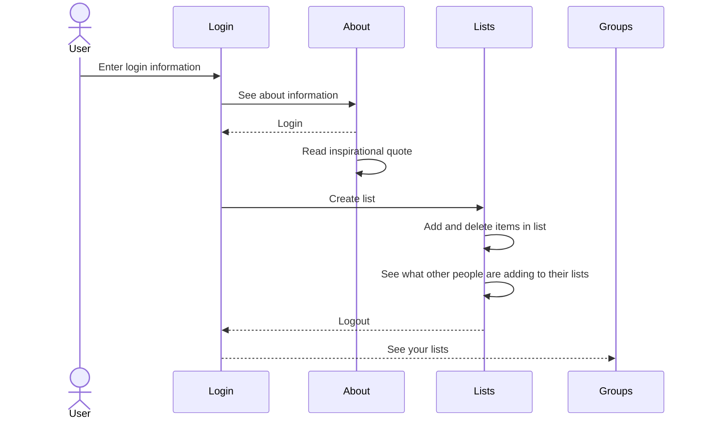

# List Maker

[My Notes](notes.md)

## 🚀 Specification Deliverable

This will be a website where people can create and share lists with other people

For this deliverable I did the following. I checked the box `[x]` and added a description for things I completed.

- [x] Proper use of Markdown
- [x] A concise and compelling elevator pitch
- [x] Description of key features
- [x] Description of how you will use each technology
- [x] One or more rough sketches of your application. Images must be embedded in this file using Markdown image references.

### Elevator pitch

My website will be a list maker where users can create lists to add and delete from and be able to share their lists with others as a community

### Design

### Key features

- Login, logout, and register
- See list items
- Receive notifications for other users lists
- See a description of the app
- Read inspirational quotes

### Technologies

I am going to use the required technologies in the following ways.

- **HTML** - Four different views, login/register controls, play, scoreboard, and about.
- **CSS** - Complementary color scheme, responsive design, button highlighting during play.
- **React** - Single page application with routing between views, reactive user controls, and state hooks.
- **Service** - Endpoints for authentication, storing/retrieving scores. Third party call to get inspirational quotes.
- **DB/Login** - Stores authentication and scores.
- **WebSocket** - Broadcast user's game notifications.

## 🚀 AWS deliverable

For this deliverable I did the following. I checked the box `[x]` and added a description for things I completed.

- [x] **Server deployed and accessible with custom domain name** - [My server link](https://simon.reecelove260.click).

## 🚀 HTML deliverable

For this deliverable I did the following. I checked the box `[x]` and added a description for things I completed.

- [x] **HTML pages** - Four different pages. One for each view.
- [x] **Proper HTML element usage** - I spent a lot of time learning about elements. I used header, footer, main, nav, img, a, fieldset, input, button, form, and many more.
- [x] **Links** - Links between views.
- [x] **Text** - About page has text.
- [x] **3rd party API placeholder** - About page has a place to display an inspirational quote.
- [x] **Images** - Image is displayed on the about page.
- [x] **Login placeholder** - Placeholder for auth on the login page.
- [x] **DB data placeholder** - Items displayed on lists page.
- [x] **WebSocket placeholder** - The lists page has a text area that will show what other user notifications.

## 🚀 CSS deliverable

For this deliverable I did the following. I checked the box `[x]` and added a description for things I completed.

- [x] **Header, footer, and main content body** - I used a common CSS file to style these (main.css).
- [x] **Navigation elements** - Bootstrap NavBar. What a time saver.
- [x] **Responsive to window resizing** - Bootstrap and `display:flex' did most the work here. I'm really happy with the game rendering.
- [x] **Application elements** - I used a lot of `display:flex` to get things to align correctly.
- [x] **Application text content** - Set all my text to Helvetica and it looks nice and clean.
- [x] **Application images** - I left the about image as is.

## 🚀 React part 1: Routing deliverable

For this deliverable I did the following. I checked the box `[x]` and added a description for things I completed.

- [x] **Bundled using Vite** - Easy to install and use Vite.
- [x] **Components** - Easy to bring the code over from HTML and CSS, but had to rework them quite a bit.
- [x] **Router** - Easy to creating the component routing.

## 🚀 React part 2: Reactivity

For this deliverable I did the following. I checked the box `[x]` and added a description for things I completed.

- [x] **All functionality implemented or mocked out** - Mostly using local storage to store user and scores. WebSocket notifications mocked with a timer.
- [x] **Hooks** - Extensive use of `useEffect`. I also had to use `useRef` so that the play top level component could execute the color sequence for the user on the child button components.

## 🚀 Service deliverable

For this deliverable I did the following. I checked the box `[x]` and added a description for things I completed.

- [x] **Node.js/Express HTTP service** - Installed Express with NPM. Default port on 4000.js`.
- [x] **Static middleware for frontend** - Simple endpoints in `service/index`.
- [x] **Calls to third party endpoints** - About page calls `quote.cs260.click`, renders the resulting JSON with React.
- [x] **Backend service endpoints** - Simple endpoints in `service/index` for auth and scores. Persists to memory until I get database support.
- [x] **Frontend calls service endpoints** - All mocked functionality removed from the frontend and replaced with calls to the service.
- [x] **Supports registration, login, logout, and restricted endpoint** - Fully support authentication and restrict access to scores.

## 🚀 DB/Login deliverable

For this deliverable I did the following. I checked the box `[x]` and added a description for things I completed.

- [x] **Stores data in MongoDB** - Scores stored in MongoDB from `service/database.js`.
- [x] **Stores credentials in MongoDB** - Auth stored in MongoDB from `service/database.js`.

## 🚀 WebSocket deliverable

For this deliverable I did the following. I checked the box `[x]` and added a description for things I completed.

- [x] **Backend listens for WebSocket connection** - Backend webSocket management executed in `service/index.js`.
- [x] **Frontend makes WebSocket connection** - Backend webSocket management executed in `src/notifier.js`.
- [x] **Data sent over WebSocket connection** - JSON representation of game notifications.
- [x] **WebSocket data displayed** - Global notifications displayed on lists page.
- [x] **Application is fully functional** - Yahoo 🎉. Ready for Demo day. I'm thinking chocolate. 🍫
