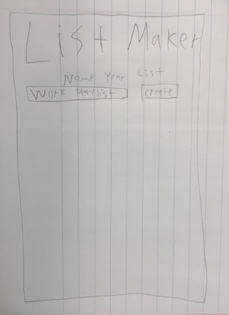
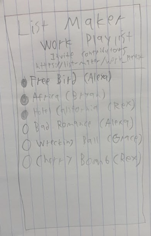

# Community List Maker

[My Notes](notes.md)

My application will create and store a list of user inputs and track which user submitted what to the list. This can be used for family shopping lists, workplace playlists, or vacation bucket lists. It will also have the ability for in people to strike through completed tasks on the list. This list will keep track of who has crossed off what.

> [!NOTE]
> This is a template for your startup application. You must modify this `README.md` file for each phase of your development. You only need to fill in the section for each deliverable when that deliverable is submitted in Canvas. Without completing the section for a deliverable, the TA will not know what to look for when grading your submission. Feel free to add additional information to each deliverable description, but make sure you at least have the list of rubric items and a description of what you did for each item.

> [!NOTE]
> If you are not familiar with Markdown then you should review the [documentation](https://docs.github.com/en/get-started/writing-on-github/getting-started-with-writing-and-formatting-on-github/basic-writing-and-formatting-syntax) before continuing.

## 🚀 Specification Deliverable

> [!NOTE]
> Fill in this sections as the submission artifact for this deliverable. You can refer to this [example](https://github.com/webprogramming260/startup-example/blob/main/README.md) for inspiration.

For this deliverable I did the following. I checked the box `[x]` and added a description for things I completed.

- [x] Proper use of Markdown
- [x] A concise and compelling elevator pitch
- [x] Description of key features
- [x] Description of how you will use each technology
- [x] One or more rough sketches of your application. Images must be embedded in this file using Markdown image references.

### Elevator pitch

I have made a super quick and easy way for a group of people to contribute to a list everyone can see. All you have to do is login, create a list, add contributors, and start adding to the list. Anyone can add to this list, everyone can see who added what to the list, and everyone can see what has been crossed off and who crossed it off.

### Design

These scetches are rough drafts of what I imagine my application looking like. On the left is the main screen where the user is prompted to name their list and create it. On the right is what I envision the live feed of the list looking like to the users. It provides all the objects in the list, who added them, and clearly shows what has been crossed off

### Key features

- Creating a list
- Adding contributors to the list
- Anyone can see the lsit
- Anyone can add to the list
- Anyone can cross objects off the list
- Show who added what to the list
- Show who crossed what off the list

### Technologies

I am going to use the required technologies in the following ways.

- **HTML** - Print out format of the application and list
- **CSS** - Making the layout of the list visually pleasing
- **React** - Prompt users to login then ask if they want to create or join a list and bring them to that list
- **Service** - Store the list name, additions, users, who added what, who crossed off what, and what is crossed off. Also provide a random usless fact via the Random Useless Facts API
- **DB/Login** - Provide the total number of list items and how many have not been crossed off
- **WebSocket** - Update additions to the list and what has been crossed off in real time for all users

## 🚀 AWS deliverable

For this deliverable I did the following. I checked the box `[x]` and added a description for things I completed.

- [x] **Server deployed and accessible with custom domain name** - [My server link](https://reecelove260.click).

## 🚀 HTML deliverable

For this deliverable I did the following. I checked the box `[x]` and added a description for things I completed.

- [x] **HTML pages** - I did complete this part of the deliverable.
- [x] **Proper HTML element usage** - I did complete this part of the deliverable.
- [x] **Links** - I did complete this part of the deliverable.
- [x] **Text** - I did complete this part of the deliverable.
- [x] **3rd party API placeholder** - I did complete this part of the deliverable.
- [x] **Images** - I did complete this part of the deliverable.
- [x] **Login placeholder** - I did complete this part of the deliverable.
- [x] **DB data placeholder** - I did complete this part of the deliverable.
- [x] **WebSocket placeholder** - I did complete this part of the deliverable.

## 🚀 CSS deliverable

For this deliverable I did the following. I checked the box `[x]` and added a description for things I completed.

- [x] **Header, footer, and main content body** - I did complete this part of the deliverable.
- [x] **Navigation elements** - I did complete this part of the deliverable.
- [x] **Responsive to window resizing** - I did complete this part of the deliverable.
- [x] **Application elements** - I did complete this part of the deliverable.
- [x] **Application text content** - I complete this part of the deliverable.
- [x] **Application images** - I did complete this part of the deliverable.
      I added a cool blue color pallete to the whole site. I made the nav bar fit nicely to the top of the screen as well as a similar footer at the bottom. I implemented a couple tables to make the placeholder data look like it is meant to be there because it is. Added a new placeholder image. Took a long time figuring out how to properly let the page fit any screen. Most of the time the main site would clip into and under the header or footer. I gave both the header and footer backgrounds so the main would go under them but I still spent a bit making sure the main was fitted properly and you would always be able to scroll down to see the whole thing. Now it looks very pretty to look at and I'm excited to start putting in the permanent applications

## 🚀 React part 1: Routing deliverable

For this deliverable I did the following. I checked the box `[x]` and added a description for things I completed.

- [x] **Bundled using Vite** - I did complete this part of the deliverable.
- [x] **Components** - I did complete this part of the deliverable.
- [x] **Router** - I did complete this part of the deliverable.

## 🚀 React part 2: Reactivity deliverable

For this deliverable I did the following. I checked the box `[x]` and added a description for things I completed.

- [x] **All functionality implemented or mocked out** - I did complete this part of the deliverable.
- [x] **Hooks** - I did complete this part of the deliverable.

## 🚀 Service deliverable

For this deliverable I did the following. I checked the box `[x]` and added a description for things I completed.

- [x] **Node.js/Express HTTP service** - I did complete this part of the deliverable.
- [x] **Static middleware for frontend** - I did complete this part of the deliverable.
- [x] **Calls to third party endpoints** - I did complete this part of the deliverable.
- [x] **Backend service endpoints** - I did complete this part of the deliverable.
- [x] **Frontend calls service endpoints** - I did complete this part of the deliverable.
- [x] **Supports registration, login, logout, and restricted endpoint** - I did complete this part of the deliverable.
      I added a random quote generator, the same one in the simon service example, to my about page. I added some css to it so it fits my website and looks nice. I also combined the login and create buttons of the login page into a single button for simplicity

## 🚀 DB deliverable

For this deliverable I did the following. I checked the box `[x]` and added a description for things I completed.

- [ ] **Stores data in MongoDB** - I did not complete this part of the deliverable.
- [ ] **Stores credentials in MongoDB** - I did not complete this part of the deliverable.

## 🚀 WebSocket deliverable

For this deliverable I did the following. I checked the box `[x]` and added a description for things I completed.

- [ ] **Backend listens for WebSocket connection** - I did not complete this part of the deliverable.
- [ ] **Frontend makes WebSocket connection** - I did not complete this part of the deliverable.
- [ ] **Data sent over WebSocket connection** - I did not complete this part of the deliverable.
- [ ] **WebSocket data displayed** - I did not complete this part of the deliverable.
- [ ] **Application is fully functional** - I did not complete this part of the deliverable.
